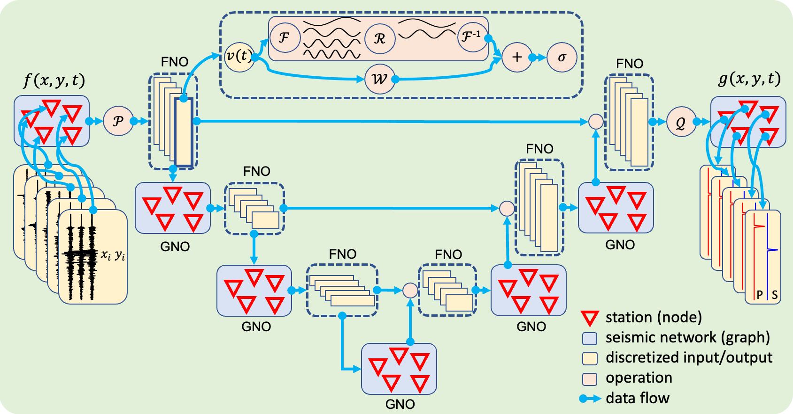

[](https://zenodo.org/doi/10.5281/zenodo.10224300)

# PhaseNO

## StraboAI implementation as a package.

Phase Neural Operator for Multi-Station Phase Picking from Dynamic Seismic Networks.



## 1. Citation

```text
Sun, H., Ross, Z.E., Zhu, W. and Azizzadenesheli, K., 2023. Phase Neural Operator for Multi-Station Picking of Seismic Arrivals. arXiv preprint arXiv:2305.03269.
```

## 2. Installation

Create an environment with conda for PhaseNO

```bash
conda create -n phaseno
conda activate phaseno
python -m pip install git+https://github.com/StraboAI/PhaseNO.git
```

## 3. Pre-trained model

Located in directory: models/*.ckpt

## 4. Example

Located in directory: example

- phaseno_predict.ipynb

  Use the pre-trained model to pick phases from one-hour continuous data of the 2019 Ridgecrest earthquake sequence.

- phaseno_plot.ipynb

  Plot the predicted probabilities and picks for all stations.


## 5. Using with BPMF

[BPMF](https://github.com/ebeauce/Seismic_BPMF) is a python package for autmoated seismic event detection, location, and template matching that relies on backprojection of "features" created from raw seismic traces. A recently published [high-resolution catalog of seismicity leading up to the 2019 Ridgecrest sequence](https://doi.org/10.1029/2023GL104375) used [Phasenet](https://github.com/AI4EPS/PhaseNet)-derived phase probability features with BPMF. To use PhaseNO phase probabilities for input into the beamforming algorithm, install the package in your environment (see above) and replace the [Phasenet-specific code](https://ebeauce.github.io/Seismic_BPMF/tutorial/notebooks/5_backprojection.html) with the following code:

```python
from PhaseNO import PhaseNOPredictor

ml_detector = PhaseNOPredictor(net, graph_type, k, radius)
```

PhaseNO uses a graph neural network algorithm, and therefore represents the seismic stations as a graph. The init arguments to `PhaseNOPredictor` specify that graph.

- `net`:  BPMF Network object containing, among other things, the seismic station locations.

- `graph_type`: str|None, either `knn` or `radius` for a k-nearest neighbors graph or a distance based graph, respectively. `None` for a fully connected graph. A fully connected graph can be very slow for a moderate to large number of stations.

- `k`: int, if a knn graph, the number of neighbors for each station.

- `radius`: numeric, if a radius graph, the nearest neighbor radius for each station.
